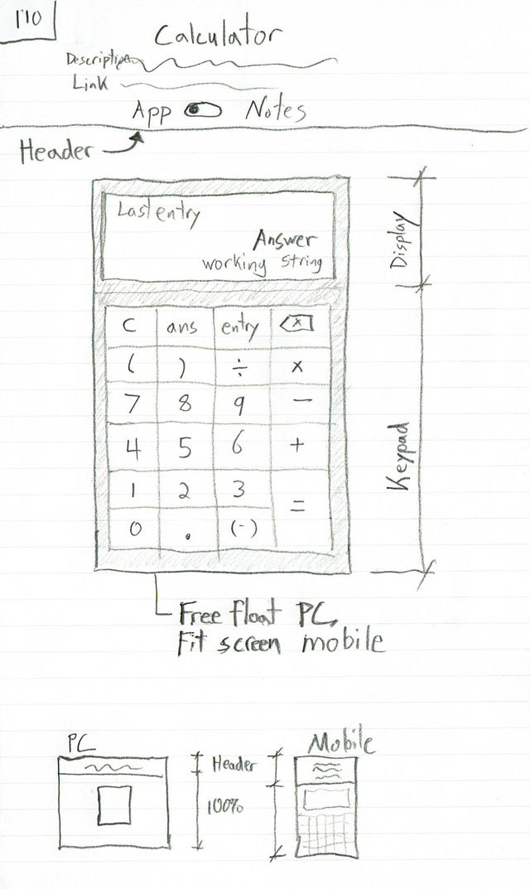
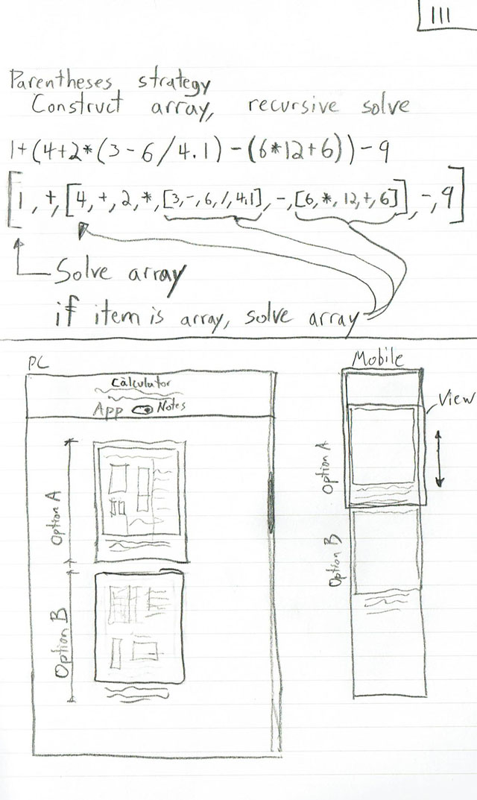

# Basic Javascript Calculator

A basic javascript calculator made with order or operations and parentheses grouping funcionality.

I made the calculator as a tool that I like and would use, improving over a basic phone app, but with a few more functions than my phone app has - Specifically - parenthetical grouping. I often want to use parentheses while doing math but I don't always have my TI-83 or TI-36 on me.

see a live version here:
http://www.mikiesmit.com/tools/calculator/

## Development Notes + Sketches:

or see a live development notes version here:
http://www.mikiesmit.com/tools/calculator/dev-notes/
